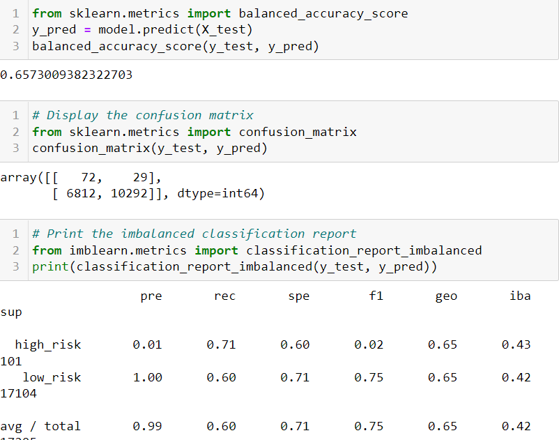
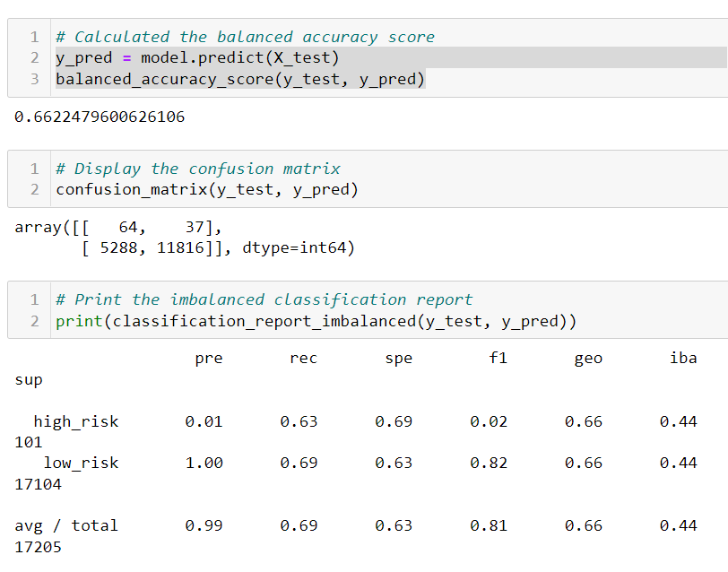

# Credit_Risk_Analysis

## Overview 
The purpose of this analysis is to utilize supervised machine learning to predict credit card risk. In addition, this project uses multiple sampling methods to validate the accuracy of machine learning models using oversampling (i.e., RandomOverSampler and SMOTE), undersampling (i.e., ClusterCentroids), combinatorial (i.e., SMOTEENN), and reduced bias models (i.e., BalancedRandomForestClassifier and EasyEnsembleClassifier). Some of the datapoints used to assess credit include loan amount, interest rate, home ownership status, and annual income.

## Results

Please see the below for the balanced accuracy scoring and imbalanced classification report for each sampling method:

-  Oversampling

RandomOverSampler

SMOTE

-  Undersampling

-  Combinatorial (Over and Under sampling)

-  Reduced Bias

BalancedRandomForest

EasyEnsembleClassifier

## Summary

Based on the results of the machine learning models the best model to use is the EasyEnsembleClassifier with over 90% precision. The over and under sampling methods proved to have a lower accuracy with a range between 54%-66%. Althought the reducwed bias methods proved to have a higher accuracy the models take significant time to run and perform. My recommendation, is the combinatorial method because is yields a better accuracy compared to over and under sampling, and is more time efficient when compared to the reduced bias models. 
